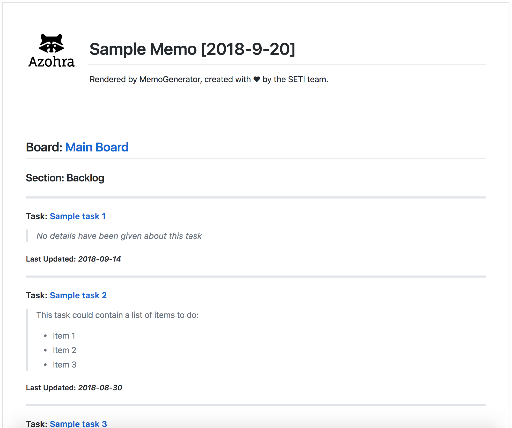

# MemoGenerator

## Productivity to the max

### An Elixir application to automatically render memos



## Installation

If [available in Hex](https://hex.pm/docs/publish), the package can be installed
by adding `memo_generator` to your list of dependencies in `mix.exs`:

```elixir
def deps do
  [
    {:memo_generator, "~> 0.1.0"}
  ]
end
```

## Built-in clients

MemoGenerator currently has a built-in jira client

How to configure at compile-time (you can modify these later)

```elixir
  config :memo_generator, jira_client: %{
    "headers" => [],
    "base_url" => ""
}
```

You much chose to enable them on application startup

```elixir
  def application do
    [mod: {MemoGenerator, [:jira_client]}]
  end
```

And you can edit their config at runtime using the MemoGenerator.Client.Config api

```elixir
  iex(1)> MemoGenerator.Client.Config.get(Jira, :base_url)
  > "https://www.example.com"

  iex(2)> MemoGenerator.Client.Config.update(Jira, new_data)
  > 

```

<p>Created with &#x2665; by Azohra.<p>
